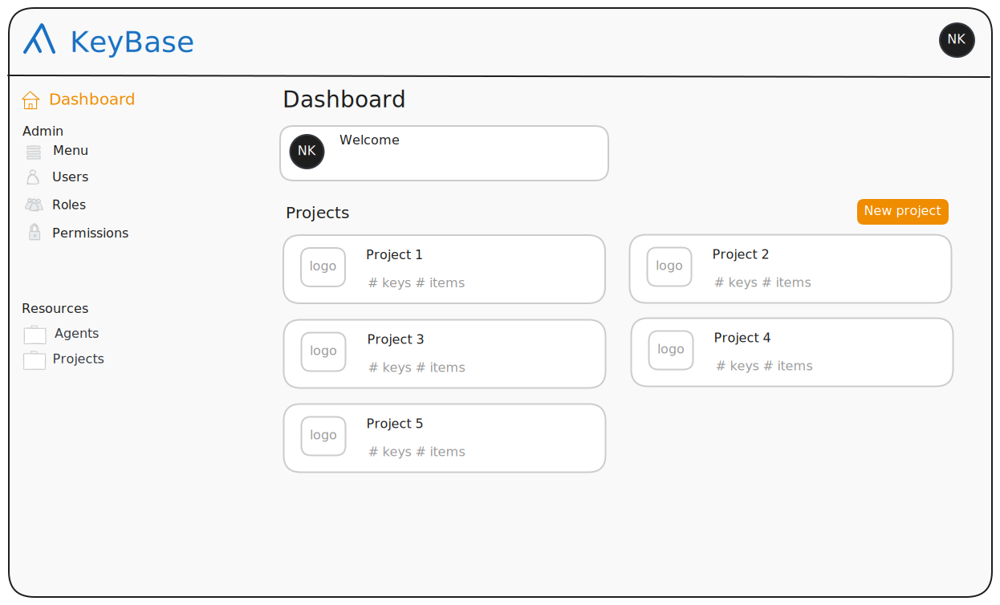
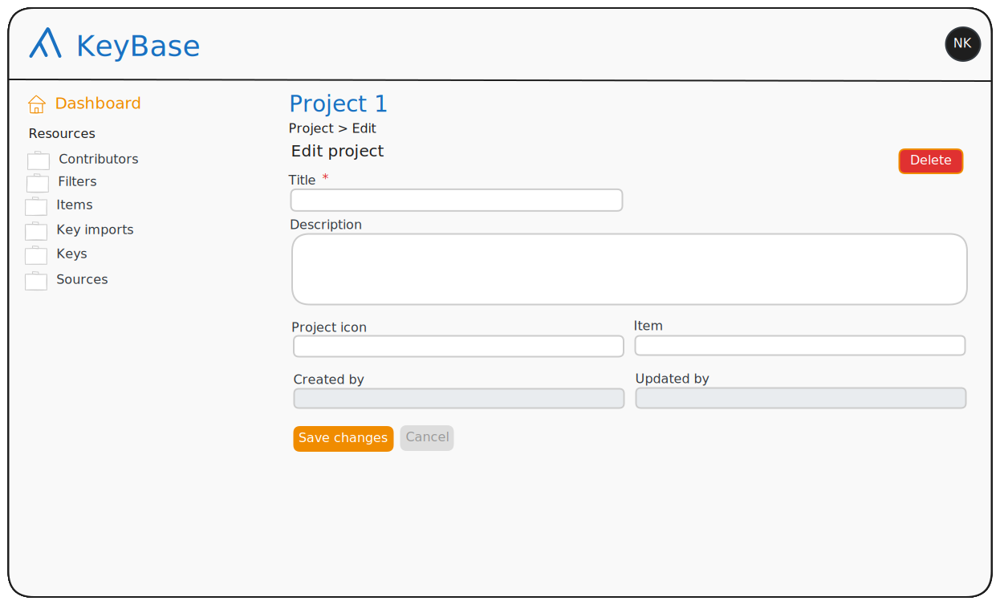
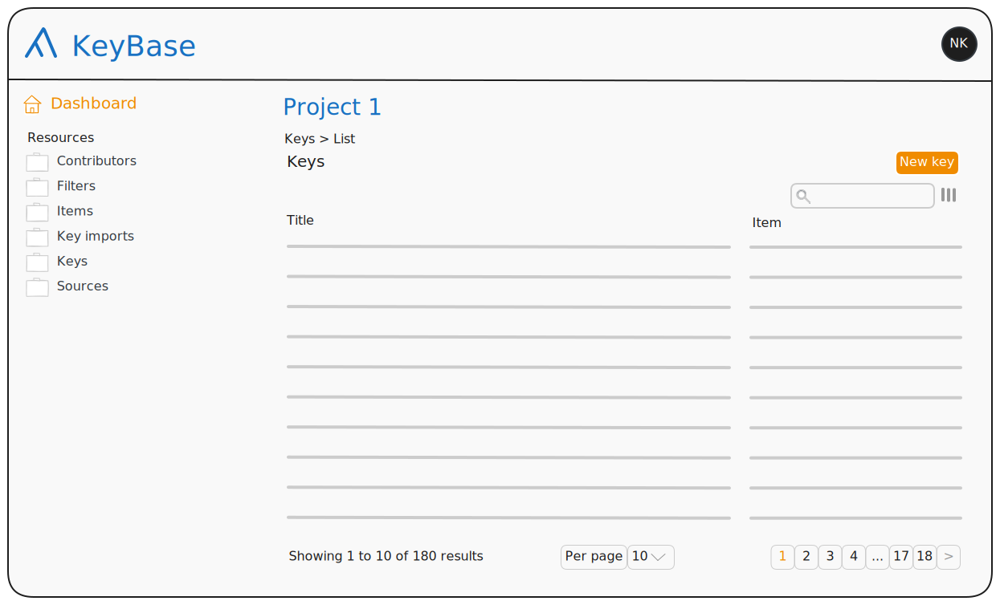
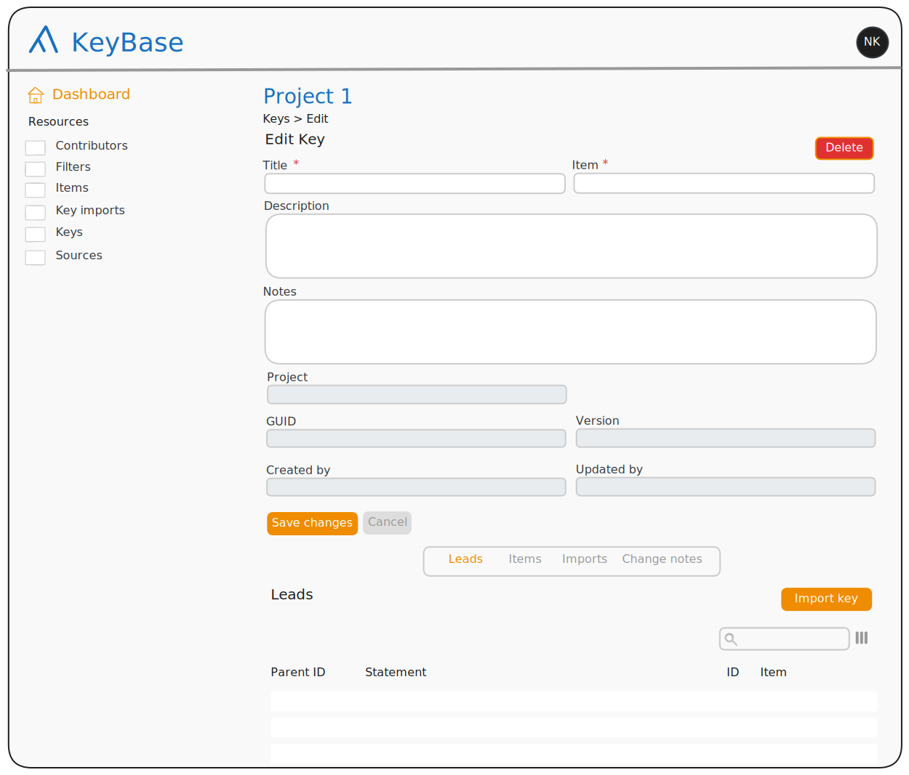
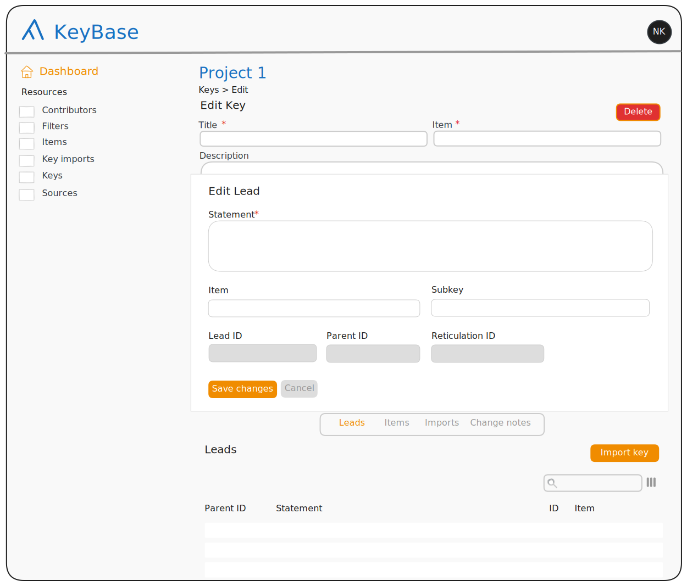

# Back-end form setup

Below I have sketched the high-level setup of the back-end that I think will work best. I will add the details for each form later.

__TOC__

## The dashboard

As everything in KeyBase is organised in projects, I think it is best to have a different dashboard for different projects, so nothing can leak from one project into another.

In my proposal, in the main pane of the dashboard (or dashboard home page), you have the user account managament as well as the projects. In fact, what is under the account management box might be the same as what is under the account icon in the top-right corner of the page, so we might be able to remove that box as well.

Unless, &commat;twocngdagzyou have any plans for the menu, the information in the left pane is only accessible to Admin users, so we might
be able to leave out the sidepane altogether.(I haven't put all this in the sketches yet, as I do not want to make them again).

## Inside a project

Once inside a project, a user has access to all the resources that are scoped to
the project. They are listed in the sidepane. We have to experiment with where
the project header (here 'Project 1') goes. Here, the project header needs to
have a link under it, otherwise there is no way to get back to the Project form
while staying inside the project. Another way we can do it is by moving the
project header to the sidepane and add the project title to the breadcrumbs,
_e.g._, `Project 1 > Keys > List`, but then we have to find a place for the
'Dashboard' link.

As you can see, I left the lists of keys, items, filters and sources out of the
Project form. I did not like that when you click on an item in these lists, the
form opens in a modal, rather than in the Dashboard. As these subforms just
repeat what is in the sidepane, I think we might as well leave them out rather
than try to change how they work. 

When clicking on an item in a list that is opened from the sidepane, the form
opens in the dashboard.

## Key

No specific changes to the key form, other than the changes that apply to all
forms. The only thing is that I have added an 'Import key' button. We will have
to see what we do about that in light of the comment I will make at the end.

Note that the form is not complete. The author and the source are missing.

In the Key form I do like the lists of leads, items and imports, as the leads do
not make sense outside the context of the key, and items and imports do not link
to anything else.

<x-alert type="warning" title="Note">

&commat;twocngdagz, I had noticed that you added a `KeyInput` model to the data
model. I understood what it was for, but did not immediately grasp all its
implications. I think now that we can remove the `ChangeNote` model and have a
`changeNote` property (corresponding to
[`skos:changeNote`](https://www.w3.org/TR/2009/REC-skos-reference-20090818/#notes))
on the `KeyInput` resource.

</x-alert>

