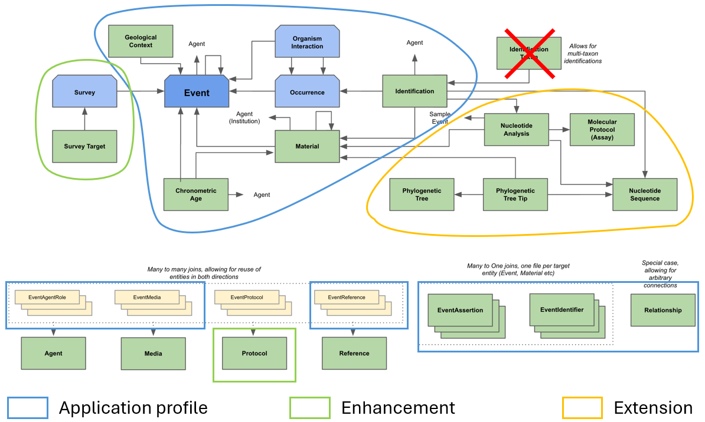
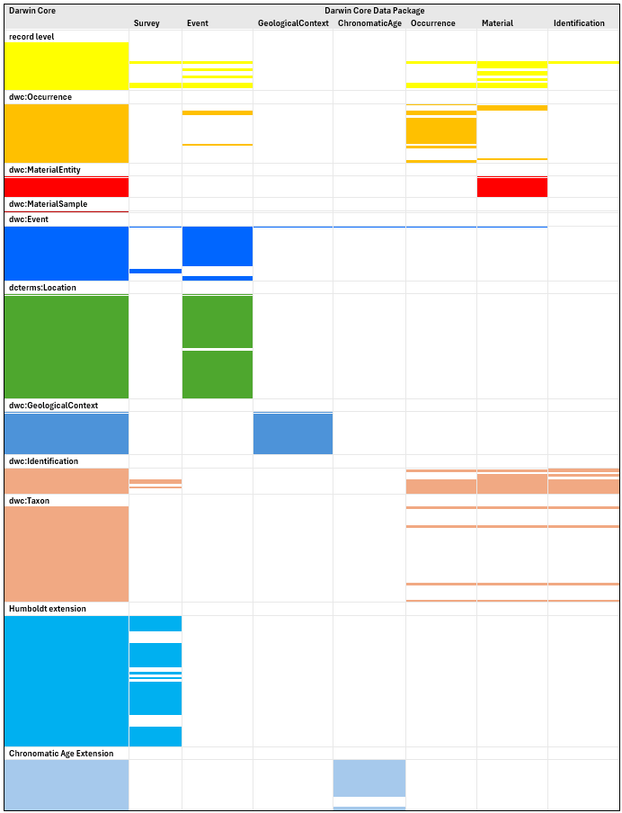
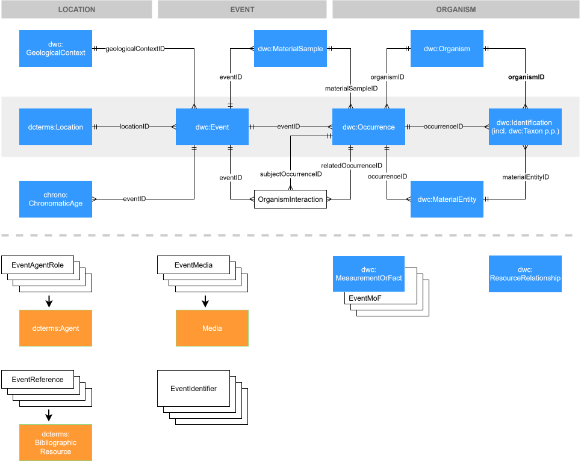

# Scope and extensibility

I am just going to treat this as a scientific article I am reviewing and pick
the whole thing apart. Not really appropriate for a GitHub issue, but I hope
people will not mind.

When I look at the figure of the conceptual model, or the Quick Reference Guide,
I see three things:

- An **application profile**, or a vehicle for Darwin Core: this is the Data
  Package
- **enhancement** of Darwin Core: new entities to be added to Darwin Core (or
  official Darwin Core extensions)
- **extension** of the Data Package with non-Darwin Core entities: this is (or
  should be) similar to the non-Darwin Core, or community, extensions to the
  Darwin Core Archive.

I think it is important to split this into three separate bodies of work for the
following reasons. First, if you have a big job, you want to split it into
smaller parts. Second, I think technically only the enhancement bit is governed
under the Vocabulary Maintenance Standard, which means community consensus is
needed for changes and additions, so you want to make that part as small as
possible. Finally, and most importantly, you want to make sure that the Data
Package works with just Darwin Core before starting to accessorise. 

## Application profile

For me the two important test cases for a Darwin Core Data Package are:

1.  It should enable delivery of all data that we can currently deliver with the
    Darwin Core Archive (without non-Darwin Core extensions and excluding Taxon
    Core data sets)
2.  We should be able to do that without having to add new terms to glue Darwin
    Core entities together.

When we look at how Darwin Core terms are distributed over the tables in the
Darwin Core Data Package, we see the following:

- With the exception of the Identification table, which is dangling, all other
  tables have foreign keys to the Event table, so the star model of the Darwin
  Core Archive is very much still there. In fact, the conceptual model is
  essentually the Event Core from the Darwin Core Archive with the Extended
  MeasurementOrFact extension. Even the direction of the relationships between
  the Event table and the other tables—they are all one-to-many—reflects the
  core–extension relationship, rather than the relationship between the entities
  in Darwin Core. For example, `dwc:GeologicalContext` is in the Event (or
  Occurrence) Core, so has a one-to-many relationship with `dwc:Event`, in the
  Darwin Core Archive, but the GeologicalContext table has a many-to-one
  relationship with the Event table in the Darwin Core Data Package. Combined
  with the fact that `geologicalContextID` is required and has to be unique,
  this will cause problems.

- `dwc:MaterialSample` and `dwc:MaterialEntity` have been lumped into a Material
  table, which is not directly connected to the Occurrence table. This makes the
  Darwin Core Data Package unfit for purpose for collections data as well as
  for environmental DNA data.

- The Identification table is not linked to any other tables when using only
  Darwin Core terms. They are linked to the Occurrence and Material tables with
  `dwcdp:basedOnOccurrenceID` and `dwcdp:basedOnMaterialEntityID`.
  Identifications are annotations, so they need to have a target.
  `dwc:Identification`s are not stand-alone objects, they depend on
  `dwc:Occurrence` or `dwc:MaterialEntity` (or `dwc:Organism`). If the
  `dwc:Occurrence` or `dwc:MaterialEntity` is not there, there cannot be a
  `dwc:Identification` either. Therefore, `dwc:occurrenceID` and
  `dwc:materialEntityID` should be used instead. Identifications cannot be based
  on their target of course, as that would be circular.

- The Occurrence and Material table contain all the properties of the
  Identification table. The reason for this that was given to me is to support
  insufficiently structured databases. You cannot do this if you want to create
  a Darwin Core Data Package that can be used by everyone, as it favours some
  parts of the community over other parts. Herbarium databases typically have a
  one-to-many relationship between specimens and identifications, because we
  need to record the identification history, but a one-to-one-to-one
  relationship between specimens, occurrences and events (except that they do
  not have occurrences), so for herbaria it might be easier to have all the
  properties of the Occurrence and Event tables in the Material table. We do
  want to use the Darwin Core Data Package, however, to be able to resolve the
  many-to-one relationships between specimens and occurrences and between
  occurrences and events that we know exist in our data. The Darwin Core Data
  Package requiring a minimum of structure, even when people think they do not
  need that in their database, is not a bad thing. People can always use the
  Darwin Core Archive. If they want to use the Darwin Core Data Package, they
  have to go all in.

- Likewise, `dcterms:Location` is lumped with `dwc:Events` in the Event table.
  That is a lot of extra fields in the Event table. Is there a rational for
  splitting off `dwc:GeologicalContext` from the Event Core and not
  `dcterms:Location`? I think for many people having `dcterms:Location` in the
  Event table makes data delivery harder rather than easier. I can also imagine
  that, once there is an `eco:Survey`, a link to `dcterms:Location` might be
  needed from `eco:Survey`.

The figure below shows how Darwin Core entities hang together in my mind. I have
divided the entity-relationship diagram in the top half of the figure into three
zones: location, event and organism. I should say that, as a biologist, my
expertise is very much at the organism end of the diagram, so I might not have
hooked up everything correctly in the lefthand side of the diagram.

The middle row in the entity-relationship diagram has the core classes of Darwin
Core, `dcterms:Location`, `dwc:Event`, `dwc:Occurrence` and `dwc:Identification`
that all Darwin Core data sets must have. The top and middle rows of the diagram
contain classes that are optional but are important for different parts of the
domain. One could visualise that one can squeeze the top and bottom rows into
the middle row and end up with the Occurrence Core of the Darwin Core Archive.

Additionally, the following may be noted:

- I have split the Material table into `dwc:MaterialSample` and
  `dwc:MaterialEntity`. I do not know if it exactly corresponds with their
  meaning in Darwin Core, but I have loosely coupled `dwc:MaterialEntity` with
  'specimen' and `dwc:MaterialSample` with 'sample'. The difference between
  those two is in how they relate to `dwc:Occurrence`, _i.e._,
  `dwc:MaterialEntity` has a many-to-one relationship with `dwc:Occurrence` and
  `dwc:MaterialSample` a one-to-many relationship. This is also why
  `dwc:MaterialSample` is in the 'event' zone and `dwc:MaterialEntity` in the
  'organism' zone of the diagram. Some data sets I downloaded from the GBIF
  Oceania Metabarcoding Data Toolkit have the same `dwc:eventID` and
  `dwc:materialSampleID` and the data I deliver myself to ALA has the same
  values for `dwc:occurrenceID` and `dwc:materialEntityID`, so I got it right at
  least some of the time.

  It should be noted that in the [Herbarium
  Berolense](https://dwcdp-ipt.gbif-test.org/resource?r=test_joerg) data set in
  the test IPT, the 'MaterialSample' that is given in the `materialEntityType`
  column in the Material table is the `ggbn:MaterialSample`, not the
  `dwc:MaterialSample` in the sense it is used here. The `ggbn:MaterialSample`
  (again, in the sense it is used in the data set) has a many-to-one
  relationship with `dwc:MaterialEntity`. In this data set, the data of the
  sample that is taken from the specimen (or which the specimen is a voucher
  for) is provided in the Material table and the specimen (or
  `dwc:MaterialEntity`) data is delivered in the Occurrence table. This is made
  to work by using the `dwc:catalogNumber` as the `dwc:eventID` in both the
  Occurrence and Material table (it is also used in `dwc:occurrenceRemarks` in
  the Occurrence table). The `dwcdp:eventCategory` is also given as 'DNA
  extraction', which might be some type of `dcterms:Event` but, at least in my
  mind, not a `dwc:Event`. The examples for `dwcdp:eventCategory` in the Quick
  Reference Guide include 'nucleotide analysis', which does the same thing, so
  it might be intended, but it makes the `dwc:Event` meaningless and breaks the
  chain of data from `dwc:Location` to `dwc:Identification`, so is not a good
  idea.

  I think the `dwcdp:derivedFromMaterialEntityID`, etc., might be intended to
  deal with this situation, but I think it is better to keep Darwin Core
  reasonably simple and use a GGBN extension to deal with the relationship
  between specimens and DNA sequences. So, use Darwin Core for what potentially
  highly disparate data sets have in common and community extensions for where
  they differ, rather than try to shoehorn everything into Darwin Core.

- `dwcdp:Survey` and `dwcdp:SurveyTarget` have been left out, simply because
  they are not in Darwin Core yet. Therefore they are enhancements. Most of the
  properties of the Survey table are in the Humboldt Extension to Darwin Core,
  but the class itself has not been defined, so I am assuming the properties
  currently belong to the `dwc:Event`.

- It would be good to have an `OrganismInteraction` class in Darwin Core, but I
  think it can already be used in the Darwin Core Data Package, as it is
  essentially a `dwc:ResourceRelationship` and is the key–value list that is the
  object of `dwc:associatedOccurrences` in table form.

The lower half of the figure I have kept largely intact. The things on the
lefthand side are strictly speaking extensions, but they are so common and used
throughout the domain, even though they are not part of the domain, so they are
probably best seen as part of the core. There are Dublin Core classes for Agent,
Media and Reference that can be used, but there is nothing like that for
Protocol, so that should be added to Darwin Core as an enhancement.

For the Media, the pivot tables have a number of properties that belong in the
Media table. As `mediaID` is required and has to be unique in the pivot tables,
there is really no reason to have these properties in the pivot tables.

`dwc:MeasurementOrFact` and `dwc:ResourceRelationship` are Darwin Core's native
extension points, for scalar values and resources respectively. I do not
understand why the Darwin Core class names are not being used. Especially the
change from 'MeasurementOrFact' to 'Assertion' does not make sense.

Just about the implementation in the IPT, I have created three data resources in
the test IPT and had a hell of a time getting data sets published. Most of this
was because I could not use a database connection, so I had to use CSV, but when
I had those issues resolved, publication still failed because of data quality
issues. Publication first failed on `coordinatePrecision` of '0', which was my
fault, so I fixed the function that creates those, but after that it also failed
on a `minimumElevation` of 9000 (because someone had forgotten to enter the
unit) and then on a negative `minimumDepth` (which was on the label).
  
Now that I was doing manual publications (and was using only a small part of our
data set), I could fix the data in the database and start over, but, if you have
scheduled publications and have people (who make errors) entering and editing
data between publications, this is going to be a major issue. Validation is
great, but it should be restricted to errors that break the data set, such as
missing keys or duplicate keys. Making data quality part of the validation
places the responsibility for data quality in the hands of the wrong people and
will seriously impact the usability of the Darwin Core Data Package.

## Enhancement

`OrganismInteraction`, `Survey` and `SurveyTarget` can be quite easily added to
Darwin Core, or the Humboldt Extension in case of the latter two.

Adding `Protocol` will probably be a bit more work. I find it a bit suspect that
there are no examples for `protocolTypeVocabulary`. You want some of those
before creating the class.

## Extension

There should be an avenue for extending the Darwin Core Archive for particular
use cases that are not entirely covered by Darwin Core. The current approach
taken here seems to be to suck everything into Darwin Core, perhaps as official
Darwin Core Extensions, and create a monolith, but I think their should be room
for community extensions.

Extensions should not change anything to the tables already in the Data Package
(trying very hard to avoid the word 'core'), so there should be no foreign keys
to tables in the extension from tables in the core. In the current Data Package
there are foreign keys from the Identification table to the NucleotideAnalysis
and NucleotideSequence tables.

With this rule in place, I think many extensions of the Darwin Core Archive can
be made suitable for the Darwin Core Data Package by creating resource
descriptions that can be stitched into the manifest of the Darwin Core Data
Package. Because of the different structure of the Data Package, multiple
extensions, _e.g._, all the GGBN extensions or all the Germplasm extensions, in
the Darwin Core Archive can be combined into a single extension for the Darwin
Core Data Package. I myself would not mind an extension for collections data
that has tables for preparations, acquisitions, loans and exchange and
nomenclatural types. This might eventually turn into an official Darwin Core
extension, but there will be a very long time that it is not.

Another way to deal with community-specific data is to not have a single Darwin
Core Data Package, but have different Data Packages for different communities
that use the part of Darwin Core that they need—but at least the
`dcterms:Location`, `dwc:Event`, `dwc:Occurrence` and `dwc:Identification`
classes—together with tables for subdomain-specific data. I am a bit worried
that people will think that the existence of the Darwin CoreData Package
obviates the need for community Data Packages like CamTrapDP.

The Herbarium Berolense test data resource I mentioned before has one-to-one
relationships between the Event, Occurrence, Material, NucleotideAnalysis and
NucleotideSequence tables. This indicates to me there is something wrong with
the data model. Also, there will be stiff opposition to adding
`PhylogeneticTree` and `PhylogeneticTreeTip` classes to Darwin Core from anyone
who has the least bit of knowledge of phylogeny.
