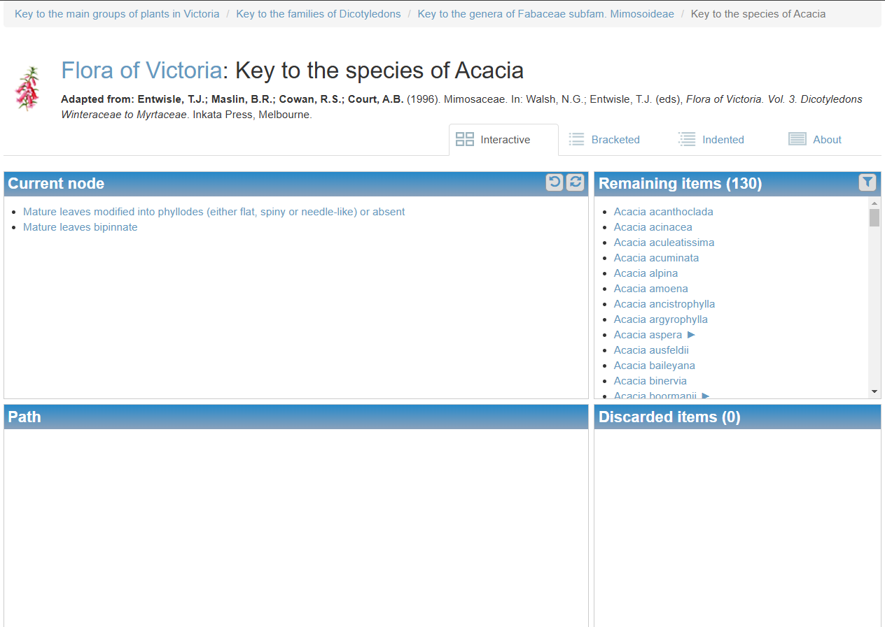
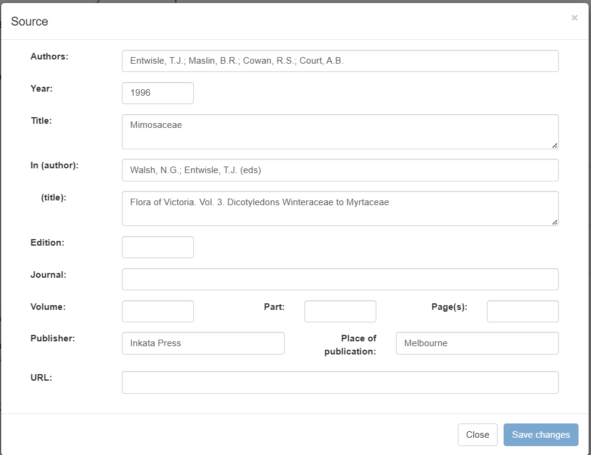
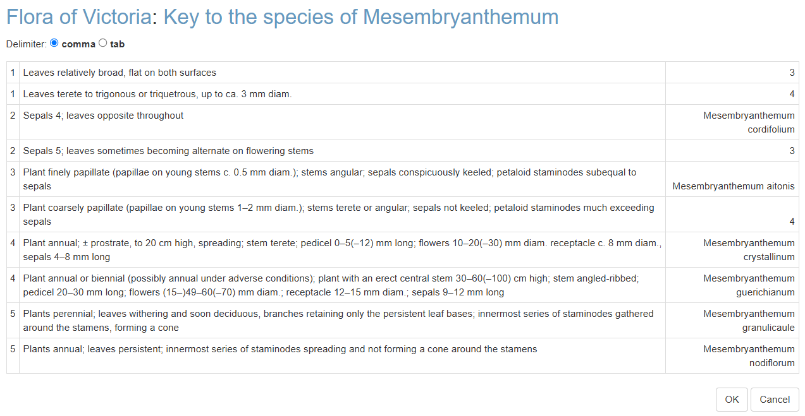
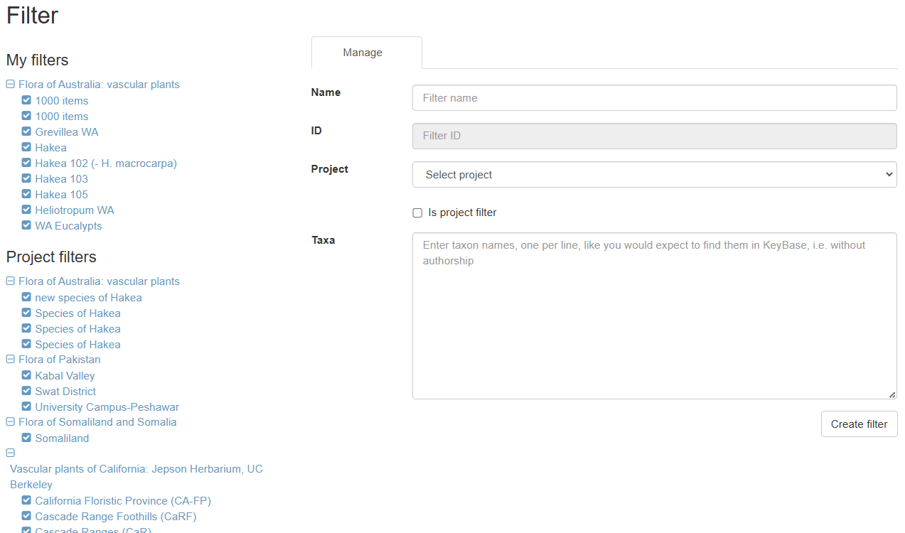

# KeyBase redevelopment

KeyBase is an application that makes traditional dichotomous identification keys
suitable for use on the web and that people can use to manage keys for use in
other applications. It has also been used by many people to create stand-alone
projects that live entirely within KeyBase. The mission of KeyBase, however, is
to make pathway keys on the web and nothing else, so KeyBase will never include
profiles, or images, or references, which are jobs for other services.

KeyBase has been managed by the Royal Botanic Gardens Victoria since 2011.

KeyBase has a plugin that people can use in their own applications that provides
keys in the form of an interactive key player, a bracketed key and an indented
key. Applications that use the plugin can choose which type of keys they want to
run. VicFlora, for example, only uses the interactive player and the bracketed
key. It also offers the option to filter items in a key, that applications can
choose to implement or not (VicFlora does not use it).

KeyBase does not currently have an editor, but people have always been able to
upload keys as CSV files. The homepage being defaced by a hacker in December
2023, however, forced us to turn off this functionality.

The aim of the current redevelopment is to convert KeyBase from a
proof-of-concept to a production-ready web application. The main focus will be
on securing the application, so that we can make the upload functionality
available again. In the process, we will also modernise the application and
bring it in line with modern web architecture and design. We'll also make sure
that KeyBase can be maintained by developers that do not have to know KeyBase
inside-out so that we do not again end up with ten years of technical debt.

The KeyBase plugin is also old, but it is working fine, so upgrading that will
be left for a next phase.

## Current codebase

The code for the current iteration of KeyBase is in the following GitHub
repositories:

Application: [https://github.com/rbgvictoria/keybase](https://github.com/rbgvictoria/keybase)

API: [https://github.com/rbgvictoria/keybase-ws](https://github.com/rbgvictoria/keybase-ws)

The code for the KeyBase plugin, which is the only bit I had thought we'd leave
intact for now, is at
https://github.com/rbgvictoria/keybase/blob/master/js/jquery.keybase.key.js.
This needs to be changed to vanilla Javascript though before we do the
redevelopment of VicFlora next (financial) year. @twocngdagz, please make a
judgement whether we should replace it as part of this project, or whether we
should postpone it. If we are going to do it now, there are some changes I would
like to make.

## Licensing

We have agreed to share the copyright for all the code between Fast Flow
Management (FFM) and the Royal Botanic Gardens Victoria (RBGV). We'll find an
appropriate Open Source licence to put on all the code.

## Architecture

We have decided on an architecture of Laravel + Inertia + React.

KeyBase will have a REST-like API for GET requests, like it has now. In fact,
this API will change very little, as the KeyBase plugin requires JSON with a
very specific structure.

## CSS framework

We will change the CSS framework from Bootstrap to Tailwind CSS, because
Tailwind works better with modern Javascript frameworks. This might change the
look and feel of the site, which is very bootstrappy at the moment.

## API

The current API is documented at https://keybase.rbg.vic.gov.au/api. We cannot
change too much to the API, because the plugin relies on a certain structure of
the JSO output for the keys and the Atlas of Living Australia (ALA) uses the
project endpoints for the Flora of Australia project in their Profiles.

Currently everything in KeyBase goes through the API. Because of our use of
Inertia, this is not really necessary in the new version but, if it is not too much extra work, I would like to keep it this way.

I will set up the the database structure and the public API endpoints myself
once the GitHub repository has been created.

## Authentication

Authentication to KeyBase will be with ORCID. ORCID has been chosen, because it
is the only identifier we can require all KeyBase users to have. If we let
people log in using their ORCID, people will not be able to give fake email
addresses etc. The ORCID API also provides Multi-Factor Authentication.

More information at
https://info.orcid.org/what-is-orcid/services/public-api/orcid-as-a-sign-in-option-to-your-system/.

I would like to have the complete OAuth2 workflow (so Laravel Passport rather
than Laravel Sanctum), so other developers can build their own applications
around the KeyBase service or fully integrate KeyBase into their applications.

## Authorization

KeyBase consists of many projects. Users of a project can have one of two roles,
Manager or Contributor. Contributors can create, update and delete their own
keys, while Managers can do the same for all keys in a project. Managers can
also edit the project's metadata, manage a project's items separately from the
keys (this entails adding links to other websites), manage filters, and assign
other users to a project.

There should also be an Administrator role. Administrators can do everything in
KeyBase, including deleting inactive projects with no keys.

## Project page

The project page has got four tabs: **Keys** (tree), **Keys** (list), **About**
and **Contributors**. Logged in users also get a **Filters** tab and Managers of
a project also get an **Items** tab. 

- The content of the **Keys** tabs comes from the
  `/project_keys_get/{projectId}` endpoint.
- The **Keys** (tree) tab shows the keys in a tree structure (the output of the
  `/project_keys_get` endpoint contains an adjacency list). This tree is
  currently created using Dynatree (https://github.com/mar10/dynatree). This is
  a JQuery library, so needs to be replaced with something vanilla Javascipt or
  React.
- The **Keys** (list) is just an alphabetical list of the keys.

- The **About** page is populated by the output of the
  `/project_meta_get/{projectId}` endpoint. It is just the description of the
  project. We might see if we can put it somewhere more prominent.

- The **Contributors** page lists the users in the project and their roles. I do
  not know where the data comes from but in the new API it will be added to the
  `projects/{id}` endpoint.

- The **Items** tab currently only has an 'Upload project items' button that
  project Managers can use to upload a CSV file with item labels and links. We
  can put a table there that is viewable by everyone and editable by project
  Managers.

- VicFlora updates project items every night but does so directly into the
  database. We should have an API endpoint for that.

- The **Filters** tab currently only has a 'Create new filter' button that sends
  people to the `/filters` page. We can drag the whole content of that page into
  the **Filter** tab, as KeyBase is not going to have filters across projects.

- The search box on the left replicates the functionality of the browser search
  (CTRL + F). It needs an autocorrect that will get its data from the
  `project_keys_get` API endpoint, like the first two tabs.

## Key page

### Interactive key, Bracketed key and Indented key tabs

- The **Interactive key**, **Bracketed key** and **Indented key** are all
  created by the KeyBase plugin, but some Javascript is required to start it up. I have done this in VicFlora (https://github.com/vicflora/vicflora-vue/tree/main/components/Keybase), but that is in VueJS, so will be slightly different from what we need here.

- The KeyBase plugin has got hooks for CSS classes, so we can put Tailwind CSS
  classes in there.

- There are hooks for other customisations to the interface as well, but the
  thing as made for KeyBase, so KeyBase mostly uses the defaults. We could use
  it to make a responsive interactive key player though.

### About tab
- The **About** tab contains the keys metadata:

- It also contains a list of the items that key out in a key (in the **Items**
  tab) and gives access to the exports and the **Edit** page (for new keys the
  **Edit** page is accessed from the **Project** page).

- KeyBase exports currently come in five formats: CSV, TXT (tab-separated
  values), LPXK (Lucid Phoenix Key format) SDD (Structured Descriptive Data
  format) and KeyBase's own format, which is in JSON. We can ditch LPXK and SDD,
  as there are no applications that use these formats anymore.

  

### Edit key

- All metadata fields are shown in the screenshot above.

- We will stop supporting the LPXK format anymore, so all uploaded keys will be
  in CSV/TXT format. KeyBase will recognise the format. We also need to
  recognise the encoding, as many people edit keys in Excel.

- The form to provide the **Source** of the key is currently in a modal. I think it would be nicer to have it in a collapsible form section.

- When uploading a new key file, you first get a screen to confirm if KeyBase
  picked the right separator:

 

- The next screen shows the result of the tests whether all the leads in the key have been correctly linked up:

(I broke this one on purpose)

- If there are any errors in the key, the 'OK' button is disabled, so people
  need to get back to the CSV file, fix the errors and re-upload it. Warnings
  can be ignored, but users do so at their own peril. Keys with reticulations
  (multiple leads that lead to the same couplet), for example, will not be
  editable if KeyBase ever gets a key editor.

- If there are no errors or warnings, this screen will not show and the key will
  be loaded.

- We discussed editable tables before and this would be a good place for one, as
  mostly these errors are easily fixed.

## Search

- The **Search** box at the top of the page searches for keys across projects.

- The **Search** box needs an autocomplete. There is an endpoint in the API for this (currently `/autocomplete_item_name`).

## Filters

- KeyBase has two types of filters, **Local filters** and **Global filters**.

- **Local Filters** are fully embedded in the KeyBase plugin, so nothing special
  needs to be done for them.

- **Global filters** are managed on the **Filters** page. Only logged-in users
  have access to that, because global filters are stored in the database.

  

- A **Global filter** is basically a list of taxa (**Items** in KeyBase).
  KeyBase only stores these items and only when the filter is applied looks for
  the keys the items are in and other keys that need to be traversed to get to
  these keys.

- There are two types of global filters, ""User filters** (indicated as **My filters**) that every user and only they can see and **Project filters** that only project Managers can make but that everybody can see.

- As the global filters are not really global anymore but apply to a single project, I would like to see if we can get rid of the **Filter page** and put it in the **Filter tab** on the **Project page**.
